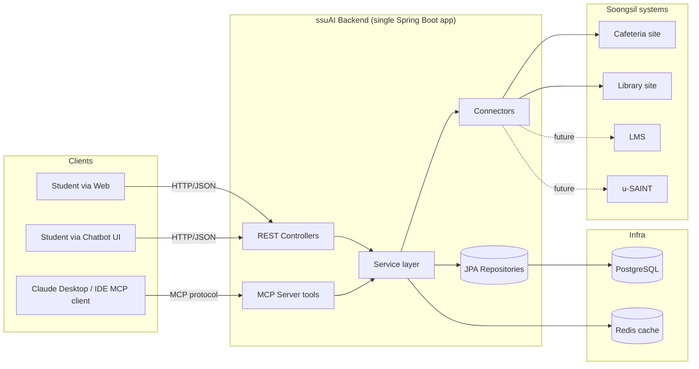
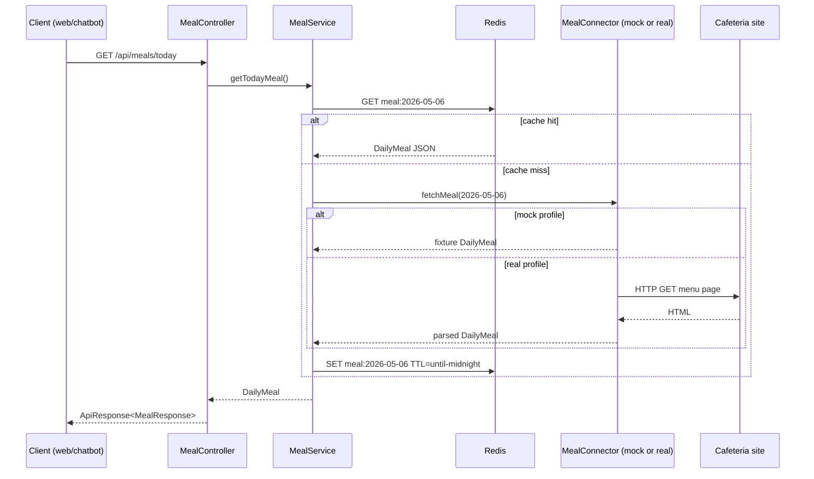

# ssuAI Architecture

## Goals of this document

Give a single, scannable view of how ssuAI is put together: the layers, the
packages, the runtime processes, and the contracts between them. Anyone
joining the project (or a reviewer) should be able to read this in five
minutes and know where any new feature should live.

## Non-goals

This document covers the **MVP plus near-term extension points**, not the
final-state system. It does not specify class names beyond the package layout
(those belong in per-feature design docs), does not design authentication,
LMS, or u-SAINT in detail, and does not cover deployment topology — those
get their own docs once they are real.

---

## 1. System context



Solid arrows are MVP. Dashed arrows are deferred (LMS, u-SAINT) and exist on
the diagram only to show **where** they will plug in — not as work scheduled
for week 1.

---

## 2. Runtime topology

The MVP is **one Spring Boot process**. It exposes:

- A REST API for the web dashboard and chatbot UI.
- An MCP server (via Spring AI) for Claude Desktop / Claude Code.

Both surfaces share the **same Service layer**, the same Connectors, and the
same Redis/PostgreSQL infrastructure. There is no duplicated business logic
between REST and MCP.

```
┌────────────────────────────────────────────┐
│  ssuAI Spring Boot application (one JVM)   │
│                                            │
│   ┌───────────┐         ┌──────────────┐   │
│   │ REST API  │         │ MCP server   │   │
│   └─────┬─────┘         └──────┬───────┘   │
│         └──────────┬───────────┘           │
│                    ▼                       │
│              Service layer                 │
│                    │                       │
│       ┌────────────┴────────────┐          │
│       ▼                         ▼          │
│  Repositories             Connectors       │
└───────┬──────────────────────────┬─────────┘
        ▼                          ▼
   PostgreSQL                External school
   + Redis                      systems
```

**Why one process for now:** one deployment unit, one config surface, no
duplicated business logic, fits Spring AI's MCP server support out of the
box. If load or independent release cadence ever justifies it, the MCP
server can be split into a separate process — but only after there is a
real reason to.

---

## 3. Layered architecture

The project follows the layered structure described in `CLAUDE.md`. The
short version of who owns what:

- **Controller** — receive HTTP requests, validate request DTOs, call a
  service, return a response DTO. No business decisions, no DB access, no
  parsing of school-site HTML.
- **Service** — application logic, transaction boundaries, deciding cache
  strategy, combining Repository and Connector results. No browser
  automation, no SQL strings, no HTML parsing.
- **Repository** — database access only (Spring Data JPA).
- **Connector** — every external school-system call. Owns the HTTP client,
  the Jsoup/Playwright parsing, and the mapping into internal DTOs.
  Connectors are interfaces with at least one implementation; they must be
  swappable and testable.

A request never crosses a layer it shouldn't. A Controller never calls a
Connector directly; a Connector never reads from the database.

---

## 4. Package layout

```
com.ssuai
├── global
│   ├── config          // @Configuration classes, beans, profile wiring
│   ├── exception       // ConnectorException, ApiException, GlobalExceptionHandler
│   ├── response        // ApiResponse<T> envelope, ErrorResponse
│   └── security        // (added when auth lands; empty for MVP)
└── domain
    ├── meal
    │   ├── controller  // MealController
    │   ├── service     // MealService
    │   ├── dto         // MealResponse, MealItem
    │   └── connector   // MealConnector (interface), MockMealConnector, RealMealConnector
    ├── library
    │   ├── controller  // LibraryBookController, LibrarySeatController
    │   ├── service     // LibraryBookService, LibrarySeatService
    │   ├── dto
    │   └── connector
    ├── chat
    │   ├── controller  // ChatController (basic chatbot endpoint)
    │   ├── service     // ChatService (uses Spring AI ChatClient)
    │   └── dto
    ├── mcp
    │   ├── tool        // @Tool methods that delegate to domain Services
    │   └── config      // MCP server registration
    └── user            // (created when auth lands; not built in MVP)
        ├── controller
        ├── service
        ├── dto
        ├── entity
        └── repository
```

Rule: **do not create a package before there is code that needs it.** The
`user` package, for instance, is shown here for orientation only — it
doesn't exist in the repo until the auth feature actually starts.

---

## 5. Connector pattern

This is the most important pattern in the codebase. Every external
school-system call goes through a Connector.

### Shape

```java
public interface MealConnector {
    DailyMeal fetchMeal(LocalDate date);
}
```

For each Connector there are at least two implementations:

- `MockMealConnector` — returns deterministic fixture data. **Always present**
  in the codebase and clearly named `Mock*`. Used by tests, by local dev
  before the real site is reverse-engineered, and as a fallback worth
  considering for demos.
- `RealMealConnector` — real implementation (Jsoup for static pages,
  Playwright for JS-heavy or login-required pages, plain HTTP for JSON APIs).

### Selection

Profiles and a config property decide which one is wired:

```yaml
# application.yml
ssuai:
  connector:
    meal: mock        # mock | real
    library-book: mock
    library-seat: mock
```

Each implementation is registered with `@ConditionalOnProperty`, e.g.:

```java
@Component
@ConditionalOnProperty(name = "ssuai.connector.meal", havingValue = "mock", matchIfMissing = true)
class MockMealConnector implements MealConnector { ... }
```

Default is `mock` so a fresh checkout runs without any external dependency.
`application-prod.yml` flips the relevant entries to `real`.

### Boundaries

- Connectors return **internal DTOs**, never raw HTML, raw JSON, or a
  `Document` from Jsoup. The "shape of the school's site" stops at the
  Connector boundary.
- Connectors throw a typed `ConnectorException` (with subtypes like
  `ConnectorTimeoutException`, `ConnectorParseException`,
  `ConnectorUnavailableException`). The Service decides what to do with it
  — return stale cache, surface a 503, or fall back to mock.
- Connectors do **not** cache. Caching is a Service-layer concern (see §8).

---

## 6. Standard response & error contract

Every REST endpoint returns the same envelope so the frontend, the chatbot,
and any future client can parse responses uniformly.

### Success

```json
{
  "data": { "...": "..." },
  "error": null,
  "traceId": "f3c1...e9"
}
```

### Error

```json
{
  "data": null,
  "error": {
    "code": "CONNECTOR_UNAVAILABLE",
    "message": "Cafeteria site is temporarily unreachable."
  },
  "traceId": "f3c1...e9"
}
```

`ApiResponse<T>` lives in `global.response`. A `@RestControllerAdvice` in
`global.exception` maps exceptions to HTTP status + error code:

| Exception                       | HTTP | `error.code`             |
|---------------------------------|------|--------------------------|
| `MethodArgumentNotValidException` | 400  | `VALIDATION_FAILED`      |
| `ApiException` (domain-thrown)  | 4xx  | exception's own code     |
| `ConnectorTimeoutException`     | 504  | `CONNECTOR_TIMEOUT`      |
| `ConnectorUnavailableException` | 503  | `CONNECTOR_UNAVAILABLE`  |
| Anything else                   | 500  | `INTERNAL_ERROR`         |

The `traceId` is whatever Micrometer / Spring Boot's observability puts on
the current request — we propagate it into the response so a user-reported
error can be looked up in logs.

---

## 7. Caching strategy

The cache-aside pattern lives in the **Service layer** (not the
Connector, not the Controller). The table below describes the
*target shape*; the current MVP implements only the cafeteria entry —
see "Current implementation" below.

Redis is the eventual store; the MVP uses an in-memory `ConcurrentMap`
(`WeeklyMealCache`) as a stepping stone since the only cached data so
far is the cafeteria menu and it refreshes weekly. Moving to Redis is a
swap at the cache-aside service boundary, not a layer rewrite.

| Data                      | Key                                     | TTL                  | Notes                                                    |
|---------------------------|-----------------------------------------|----------------------|----------------------------------------------------------|
| Today's cafeteria meal    | `meal:{date}`                           | until midnight       | Menu rarely changes mid-day; refresh once per day.       |
| Library book search       | `library:book:{normalized-query}`       | 5 min                | Search results are stable enough; user can re-search.    |
| Library seat status       | `library:seat:{room-id}`                | 30 s                 | Changes minute-to-minute; very short TTL.                |
| (future) LMS assignments  | `lms:assignments:{userId}`              | 5–15 min             | Per-user; invalidated on user-triggered refresh.         |

Keys are namespaced (`<domain>:<entity>:<id>`) so a future bulk-invalidate
is straightforward.

Cache misses fall through to the Connector. Connector failures while a stale
cache value exists are an explicit Service decision — for the MVP, prefer
returning a 5xx and let the client retry rather than serving stale data
silently. Reconsider per-feature when real data arrives.

### Current implementation — `WeeklyMealCache`

The cafeteria menu changes once per week. Rather than scrape
`soongguri.com` on every chat turn or REST request, `WeeklyMealCache`
preloads the data:

- `@PostConstruct` warms the cache for the current week on application
  startup (all 6 restaurants × 7 days = 42 entries).
- `@Scheduled(cron = "0 0 6 ? * MON", zone = "Asia/Seoul")` refreshes
  the cache every Monday at 06:00 KST.
- `MealService.getMealForRestaurant(date, restaurant)` is a cache-aside
  lookup with connector fallback for cache misses (e.g. dates outside
  the current week).

This is the only cache active in the MVP. Library / LMS rows in the
table above stay aspirational until those domains land.

---

## 8. Configuration & profiles

Three profiles to start:

- `dev` — default for local runs. All connectors `mock`. H2 or local
  Postgres. Permissive logging.
- `test` — used by Gradle test tasks. All connectors `mock`. H2 in-memory.
  No external network.
- `prod` — real Postgres, real Redis, connectors flipped to `real` per
  feature as they become production-ready.

Files: `application.yml` (shared defaults) + `application-{profile}.yml`.
Secrets are **never** committed. They come from environment variables and
are referenced as `${ENV_VAR_NAME}` in the YAML.

The MVP needs no secrets (all data is public). The placeholders below are
documented now so they're ready when the relevant features arrive:

| Env var                | Used by         | When           |
|------------------------|-----------------|----------------|
| `SSUAI_DB_URL`         | Spring Data JPA | from day 1     |
| `SSUAI_DB_USER` / `SSUAI_DB_PASSWORD` | Spring Data JPA | from day 1 |
| `SSUAI_REDIS_URL`      | Cache           | from day 1     |
| `SSUAI_OPENAI_API_KEY` (or equivalent) | Spring AI ChatClient | when chatbot lands |
| `SSUAI_CREDENTIAL_ENCRYPTION_KEY` | (future) user credential store | when LMS/u-SAINT login lands |

---

## 9. Logging & observability

What to log on every request:

- HTTP method, route, status, latency.
- `traceId` (same one returned in the response).
- Connector name and `cache hit | cache miss | connector call` per
  external interaction.

What **never** to log, ever:

- Student passwords, u-SAINT/LMS credentials, session cookies, tokens.
- Anything that looks like a student ID, name, or grade.
- Full request bodies that may contain the above.

These rules are repeated in `docs/security.md` (to be drafted) — that doc
is the source of truth; this section is just the architecture-level
reminder.

Liveness check: `/actuator/health` (Spring Boot Actuator). Metrics and
distributed tracing are deferred until there's something worth measuring.

---

## 10. End-to-end data flow — `GET /api/meals/today`

This is the template every future MVP feature copies.



Numbered:

1. Controller receives the request, validates (nothing to validate here),
   calls the service.
2. Service builds the cache key, checks Redis.
3. On hit, return immediately.
4. On miss, call the Connector. The Connector is either the mock or the
   real implementation depending on `ssuai.connector.meal`.
5. Service stores the result in Redis with the appropriate TTL.
6. Service returns the internal DTO.
7. Controller wraps it in `ApiResponse<T>` and returns it.

Every later read endpoint should look like this. If a feature can't fit
the template, that's a signal worth discussing before coding.

---

## 11. MCP integration

The MCP server is a Spring AI feature registered inside the same Spring
Boot app. Each tool is a method that delegates to a domain Service:

```
Claude Desktop / IDE
        │  (MCP protocol)
        ▼
   MCP server (Spring AI)
        │
        ▼
   @Tool methods in domain.mcp.tool
        │
        ▼
   Domain Services  ◄───── REST Controllers also call here
        │
        ▼
   Connectors / Repositories
```

MVP tools (all read-only):

| Tool                       | Delegates to                        |
|----------------------------|-------------------------------------|
| `get_today_meal`           | `MealService.getTodayMeal()`        |
| `search_library_book`      | `LibraryBookService.search(query)`  |
| `get_library_seat_status`  | `LibrarySeatService.getStatus()`    |

Rules:

- **MCP tools never bypass the Service layer.** No tool reaches into a
  Connector or Repository directly. This keeps caching, validation, and
  error handling consistent across REST and MCP.
- Tool inputs and outputs are explicit DTOs — no opaque maps, no
  free-form strings as outputs.
- Risky / write tools (seat reservation, LMS submission, etc.) are out of
  scope for the MVP. When they arrive they will require explicit user
  confirmation, audit logging, and a dry-run mode (see `docs/mcp-tools.md`
  once drafted).

---

## 12. Frontend architecture (brief)

- **Next.js (App Router) + TypeScript + Tailwind CSS + shadcn/ui** for the
  web dashboard.
- **TanStack Query** for server state (caching, retries, background
  revalidation) so the UI stays simple and the backend can stay stateless.
- Backend URL is read from an env var (`NEXT_PUBLIC_SSUAI_API_BASE`) — no
  hard-coded hosts.
- The MVP frontend is three cards (today's meal, library book search,
  library seat status). No login, no personalization. The frontend's job
  in week 1 is to prove the API contract end-to-end, not to be pretty.

A separate frontend design doc can grow from here when there's enough
surface area to justify it.

---

## 13. Testing topology

Layered tests mirror the layered code:

- **Unit tests** — `*Service` classes with Connectors and Repositories
  mocked. Pure business logic.
- **Slice tests** — `@WebMvcTest` for Controllers; verifies request
  validation, response envelope, and HTTP status mapping.
- **Connector tests** — Jsoup connectors against **fixture HTML** stored
  under `src/test/resources/fixtures/`. HTTP-based connectors against
  WireMock or MockWebServer. Tests must be deterministic.
- **Integration tests** — `@SpringBootTest` with Testcontainers for
  Postgres and Redis. Added once the data layer becomes non-trivial; not
  required for week 1.

Hard rule: **automated tests never call real u-SAINT, real LMS, or any
authenticated school endpoint.** Manual smoke scripts can, but they live
outside the CI test suite.

---

## 14. Future extension points

Each deferred feature already has a home in this architecture. Knowing
*where* it lands is what lets us defer it without painting into a corner.

| Future feature              | Where it lives                                                                 |
|-----------------------------|--------------------------------------------------------------------------------|
| User auth for ssuAI itself  | `domain.user` + `global.security` (Spring Security, JWT or session).           |
| LMS read-only integration   | New `domain.lms` package, with `LmsConnector` (Playwright-based).              |
| u-SAINT read-only           | New `domain.usaint` package, same pattern as LMS.                              |
| Encrypted credential store  | `domain.user.entity.SchoolCredential` + AES-GCM via `SSUAI_CREDENTIAL_ENCRYPTION_KEY`. |
| Notifications               | New `domain.notification` package; Redis for delivery state, web push first.   |
| Action MCP tools            | New `@Tool` methods in `domain.mcp.tool`, each requiring user confirmation, audit log row, and a dry-run mode. |
| Mobile app                  | Separate Expo project; reuses the existing REST API. No backend changes.       |

The architecture's job through the MVP is to make sure none of these
require rewriting the Service or Connector layers — only adding to them.

---

## 15. Open questions

To resolve before week-1 implementation:

- **Response envelope shape.** The `{ data, error, traceId }` form above is
  a starting proposal. Worth checking if there's a Spring convention or a
  team preference before committing.
- **Trace ID source.** Use Spring Boot 3 + Micrometer's built-in
  `traceId`, or add a custom `RequestIdFilter`? Built-in is the simpler
  default.
- **OpenAPI from day 1?** Recommended: yes — `springdoc-openapi` is cheap
  to add, gives the frontend a typed client generator, and is visibly
  useful in a portfolio.
- **Do we want a `domain.common` package** for shared DTOs/enums, or keep
  duplication low by living without it until a real shared concept appears?
  Default: live without it.
